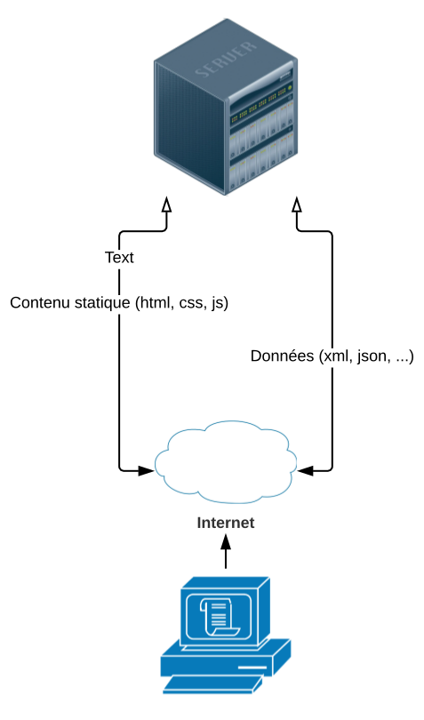
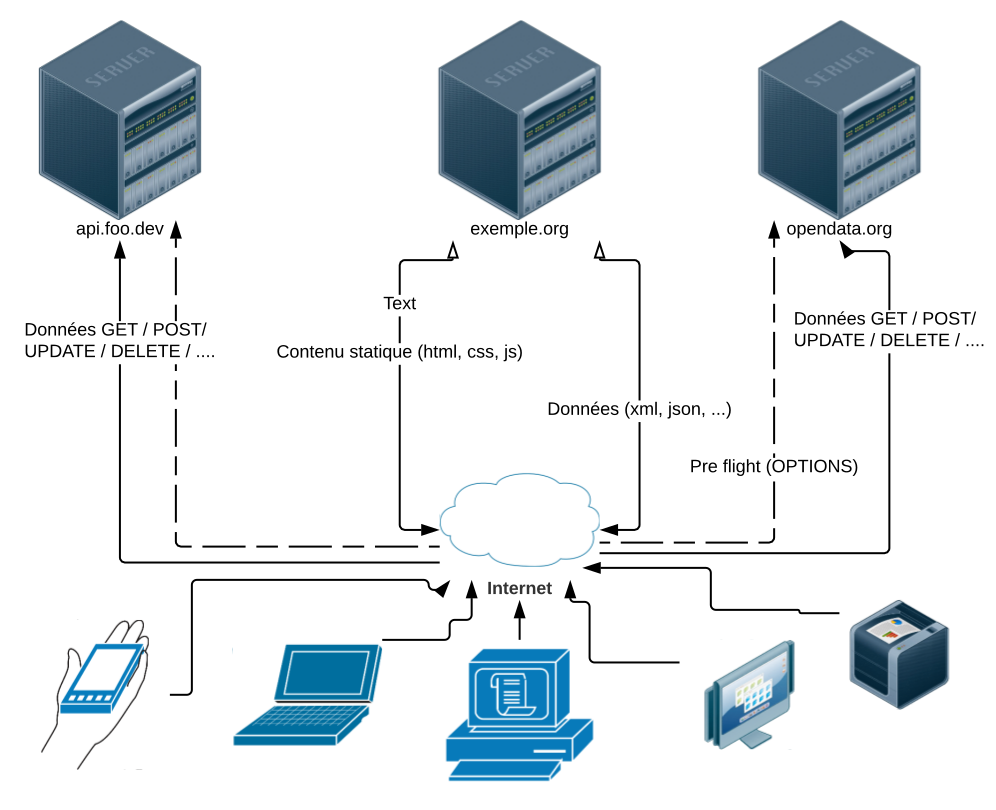
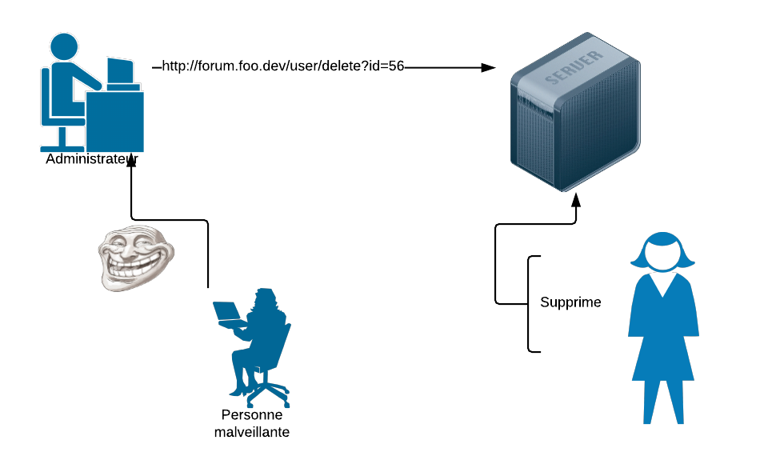

+++
title = "Cors, XSS, CSRF, SQLInjection #BackToTheBasics"
subtitle = "Retour sur les basiques de la sécurité Web"
summary = "Pas besoin d'être RSSI ou DevOpsSec pour se soucier de sécurité. Que l'on soit développeur back ou front, la sécurité est l'affaire de tous. Pourtant, on la confie souvent aveuglement à nos frameworks. Mais alors comment vérifier la sécurité de nos données et de nos utilisateurs."
date = 2019-06-05T00:00:00Z
draft = false

# Authors. Comma separated list, e.g. `["Bob Smith", "David Jones"]`.
authors = ["Adrien Pessu"]

# Tags and categories
# For example, use `tags = []` for no tags, or the form `tags = ["A Tag", "Another Tag"]` for one or more tags.
tags = ["Web", "JavaScript", "securité", "XSS", "Cors"]
categories = []

# Projects (optional).
#   Associate this post with one or more of your projects.
#   Simply enter your project's folder or file name without extension.
#   E.g. `projects = ["deep-learning"]` references 
#   `content/project/deep-learning/index.md`.
#   Otherwise, set `projects = []`.
# projects = ["internal-project"]

# Featured image
# To use, add an image named `featured.jpg/png` to your page's folder. 
[image]
  # Caption (optional)
  caption = ""

  # Focal point (optional)
  # Options: Smart, Center, TopLeft, Top, TopRight, Left, Right, BottomLeft, Bottom, BottomRight
  focal_point = ""
+++


# Introduction

Souvent la question de sécurité d'une applicaton se posent une fois qu'elle est finie. Lorsqu'un client demande une audit de sécurité, ou pire, quand une attaque est opérée.

C'est pourquoi, il faut se pré-occuper de la sécurité de vos applications avant et pendant le développement.

Lors de la conception, il faut identifier les failles possibles de l'architecture et des composants choisies.

Il faut également que chaque développeur surveille la sécurité de son développement comme il le fait déjà avec un test unitaire.

Dans ce billet nous allons voir quelques failles les plus populaires selon le top 10 OWASP (Owasp est une communauté en ligne qui met en avant les problémes de sécurité des applications Web.)

Nous verrons des failles et quelques moyens de s'en prémunir mais nous ne verrons pas de moyens universelles de corriger les failles car chaque applications et chaque composants sont différents. Il n'y a pas de "silver bullet".

# Cross Origin Resource Sharing

Cors a été proposé initialement pour son 
inclusion dans [VoiceXML](https://fr.wikipedia.org/wiki/VoiceXML), afin de permettre des requêtes cross-origin sûres par le navigateurs VoiceXML.

Avant 2006, date du début du projet à la W3C, les applications web fonctionnaient de la manière suivante : 



A partie d'un navigateur, nous ne pouvions accéder qu'à un seul site à la fois (hors iFrame). C'est à dire que le contenu statique : html, css et js étaient sur le même serveur que les données en json ou xml.

Il a bien eu le JsonP qui permet de faire des requêtes http avec la méthode Get mais avec l'essort des api REST, la méthode Get n'est pas suffisante.

Avec CORS, l'accès à un site web ressemble un peu plus à : 



Le site  est sur un serveur et les données sont sur un autre serveur, qui est partagé avec d'autres sites et auquel on accède avec des requêtes HTTP avec les méthodes : Get, Post, Put, Delete, ...

Pour ce faire, il faut activer CORS sur le serveur. Même si, en tant que développeur, nous constatons les erreurs CORS sur le front c'est bien une configuration serveur qu'il faut activer. 

Enfin presque, puis'il faut aussi ajouter lors à l'appel Rest, un attibut à l'entête de la requête. Cet attibut s'appele "origin". La valeur de cette attribut est l'adresse avec laquelle, nous faisont la requête. Une adresse est composé d'un protocole (http, https), d'un domaine et parfois un sous-domaine et enfin d'un port, ce port est souvent caché quand c'est celui par défaut (80 ou 443).

Une fonctionnalité de CORS est depuis implémentée dans les navigateurs, elle s'appele le "pre-flight". Plutôt que d'envoyer une requête Post avec un "payload" volumineux, le navigateur va lancer une petite requête avec la méthode Option, dans cette requête, il va ajouter les attributs suivant : 

- origin : l'adresse d'origine de la requête
- Access-Control-Request-Method : la ou les méthodes http utilisés pour effectuer des requêtes sur le serveur
- Access-Control-Request-Headers : la liste des attributs de l'en-tête de la requête.

et en retour, nous aurons les paramètres suivants : 

- Access-Control-Allow-Credentials
- Access-Control-Expose-Headers
- Access-Control-Max-Age
- Access-Control-Allow-Methods
- Access-Control-Allow-Headers

Lors de la configuration du serveur, il est très important de ne pas laisser passer toutes les adresses possibles avec le caractère * qui est le wildcard. Il serait plus sécuriser de spécifier toutes les adresses possibles, même en développement (http://localhost). On peut cependant utiliser le caractère * dans une adresse, mais il faut prendre des précautions. 

Par exemple : l'adresse https://\*google.com pour être utilisée par l'origine https://notgoogle.com et l'adresse https://google.com* par l'adresse https://google.com.evil.com

L'interêt de Cors est donc de pouvoir partager des ressources en toutes sécurités en limitant la couverture aux attaques.

# Cross Site Scripting (XSS)

Le Cross site Scripting autrement appelé XSS (CSS était déja pris) désigne une faille qui permet de détourner le comportement d'une application Web par le biais d'un script.

Prenons l'exemple suivant : 
```
    var urlParams = new URLSearchParams(window.location.search);
    
    const NAME = urlParams.has('name') ? urlParams.get('name') : 'Adrien';

    document.write(NAME);
```

Dans cette application, le paramètre de l'URL qui s'appelle "name" sera affiché dans le document.

Si le paramètre "name" prend la valeur "<script>alert(document.cookie)</script>", l'application ajoutera une script qui affichera les cookies de l'application.

Cette application comporte donc une faille XSS.

Cette faille sera bien sûr difficile à rencontrer de nos jours, nous n'utilisons plus ```document.write```, nous utilisons des frameworks comme angular, react ou vue.

Il existe dans ces frameworks, un moyen d'afficher dynamiquement du contenu interprétable par un navigateur comme du HTML et par extension du Javascript. Dans React ou dans Vue, il suffit d'ajouter le l'attribut : 
- React : 
```
dangerouslySetInnerHTML={{
  __html: `${dynamicContent}`,
}}
```

- Vue : 
```
<div v-html="$dynamicContent" ></div>
```

Dans ces deux cas, si le contenu de la variable ```dynamicContent`` est ``` %3Ca%20onmouseover=alert(document.cookie)%3Eclick%20me!/%3C/a%3E ``` ce qui est la version échappée de ``` <a onmouseover=alert(document.cookie)>click me!/</a> ```. Ce code va ajouter un lien qui au survole du curseur affichera le contenu des cookies du site.

Une faille XSS est un point d'entré dans l'application pour détourner son comportement et récupérer des informations confidentielles, renvoyer l'utilisateur vers un autre site,... La limite des détournements possible est notre imagination. Il y aussi beaucoup d'exemple dans l'actualité.

# Cross-Site Request Forgery

Prennons, comme exemple, un forum de discution avec l'illustration suivante : 


Une personne malveillante peut cacher dans un message un script malveillant. Ce script a pu être ajouté dans le message par une faille XSS ou bien caché par dans une image.
L'administrateur en ouvrant le message va éxécuter le script malveillant qui va lancer l'adresse : http://forum.foo.dev/user/delete?id=56 qui va supprimer le compte utilisateur de la victime.

On nottera que l'identifiant est séquence, ce qui est une mauvaise pratique.

Un moyen de se prémunir d'une attaque CSRF est d'utiliser un CSRF token c'est-à-dire un jeton généré par le serveur qui sera ajouté au liens. Ce mécanisme permettra au serveur avant d'éxécuter une requête de vérifier que le token en paramètre a bien été généré par lui-même.

# SQL Injection

L'injection est la faille numéro 1 dans le TOP 10 Owasp des failles. C'est-à-dire que c'est la faille la plus répendue.

Regardons comment fonctionne une injection SQL avec un petit exemple. Prenons un formulaire d'inscription à une newsletter, contenant un champ de saisie d'une adresse email.

Le script d'insertion SQL derrière se formulaire serait le suivant : 
```
    INSERT INTO subscriber VALUES (\'' + subscriber + '\'); 
```

Si la variable subscriber contient bien une adresse email, l'instruction SQL sera éxécuté sans soucis.

Mais si à la place de l'adresse email, un utilisateur malveillant insère : 
```
    a@a.a'); DELETE FROM subscriber; SELECT ('1
```

La requête complète sera : 
```
    INSERT INTO subscriber VALUES ('a@a.a'); DELETE FROM subscriber; SELECT ('1'); 
```

Une instruction d'insertion, un instruction qui supprime le contenu de la table et enfin un inscription qui termine sans erreur le script.

Le meilleur moyen de s'en prémunir est de protéger toutes les entrées utilisateurs. En java, nous aurions pu utiliser la méthode ```prepareStatement```.

# Conclusion

En conclusion, il n'y a pas de sylver bullet en sécurité. Il faut analyser le code, les dépendances et toutes les entrée utilisateurs. Il faut vérifier que notre application n'est pas vuknérable à une faille du top 10 Owasp. D'ailleurs, sur le site de l'[Owasp](https://www.owasp.org/), il y a beaucoup d'exemple de chaine de caractères à insérer dans les formulaires pour tester les failles Xss. Il existe aussi des outils comme [snyk](https://snyk.io/) qui analyse les failles (CVE) dans les dépendances de vos applications dans quasiment tous les langages, et ceci peut même être ajouté à l'intégration continue.


