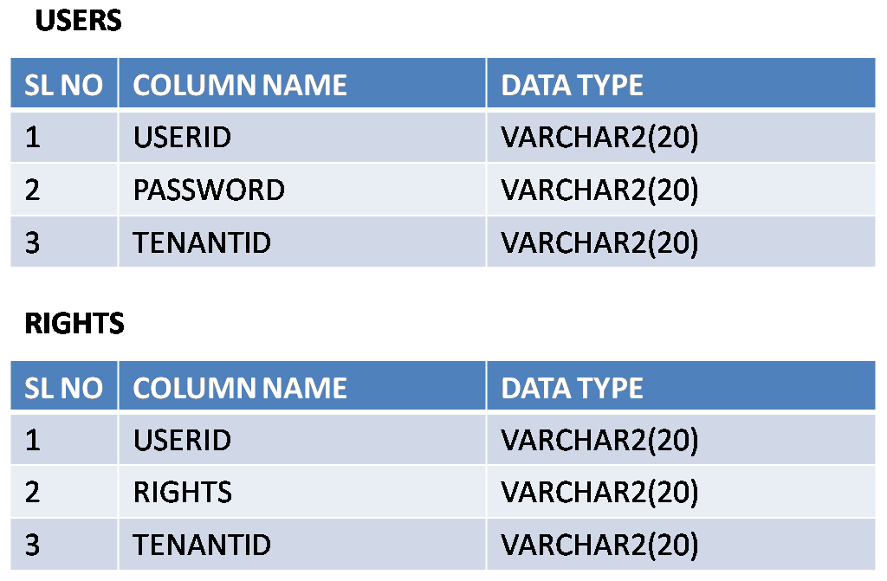
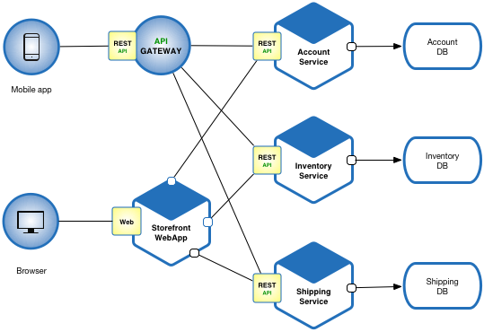
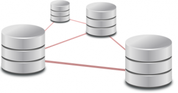

+++
title = "Comment construire une application multi-tenant?"
subtitle = "Différentes manière de construire une architecture multi-tenant"
summary = ""
date = 2019-04-10T00:00:00Z
draft = false

# Authors. Comma separated list, e.g. `["Bob Smith", "David Jones"]`.
authors = ["Adrien Pessu"]

# Tags and categories
# For example, use `tags = []` for no tags, or the form `tags = ["A Tag", "Another Tag"]` for one or more tags.
tags = ["Architecture", "Microservice", "multitenant", "Web"]
categories = []

# Projects (optional).
#   Associate this post with one or more of your projects.
#   Simply enter your project's folder or file name without extension.
#   E.g. `projects = ["deep-learning"]` references 
#   `content/project/deep-learning/index.md`.
#   Otherwise, set `projects = []`.
# projects = ["internal-project"]

# Featured image
# To use, add an image named `featured.jpg/png` to your page's folder. 
[image]
  # Caption (optional)
  caption = ""

  # Focal point (optional)
  # Options: Smart, Center, TopLeft, Top, TopRight, Left, Right, BottomLeft, Bottom, BottomRight
  focal_point = ""
+++

Cet article est inspiré de l’épisode 80 de www.fullstackradio.com. Pour pouvoir l’améliorer, je serait ravi de lire vos retours constructifs :)

# Qu’est ce qu’une application multi-tenant?
Une application multi-tenant est une application partagée entre plusieurs tenants, on définit un tenant comme un ou plusieurs utilisateurs appartenant au même groupe ou à la même organisation.

Les données de chaque tenant sont isolées.

Des utilisateurs de tenants différents peuvent donc avoir l’impression d’utiliser une application différente.

# Solutions
Voici donc quatre solutions pouvant répondre à une architecture applicative multi-tenant.

Dans chacune de ces solutions, un identifiant est créé pour chaque tenant et cet identifiant est porté par l’utilisateur. Un utilisateur pourrait porter plusieurs identifiants de tenant.

## Un identifiant applicatif par tenant
Pour chaque tenant de votre application, générez un identifiant et ajoutez-le sur chacun de vos objets métiers.

Pour chaque requête de sélection, de mise à jour ou de suppression, il faut rajouter cet identifiant en restriction. À chaque requête de création, il faudra l’ajouter également. Pour des questions de performance, il faudra optimiser la base de données par la création par exemple d’un index.

> https://www.developer.com/java/ent/extend-spring-security-to-protect-multi-tenant-saas-applications.html

## Une instance de l’application par tenant

> http://microservices.io/patterns/microservices.html

Dans cette approche, on isole l‘application ou le service qui accède à la base de données. Cette isolation est faite par le répartiteur de charge (load balancer). À la lecture de la requête (HTTP le plus souvent), il distinguera l’identifiant du tenant dans le chemin, les paramètres, voir l’en-tête de la requête pour la rediriger vers une instance de l’application ou du service dédié au tenant correspondant.

Cette approche est très pertinente dans le cas d’une architecture en microservices, elle l’est surement moins un avec une application monolithique, quand celle-ci supporte un coût d’hébergement important.

## Une base de données par tenant

Dans ce cas, l’isolation des données se fait directement dans la base de données. C’est-à-dire que les données stockées en base pour le bon fonctionnement de l’application et qui sont communes à tous les tenants sont dans une base commune, mais dès qu’un utilisateur veut lire ou écrire de la donnée, il devra le faire dans la base de données du tenant auquel il est connecté.

On pourrait même stocker les données propres à un tenant dans un schéma spécifique à un tenant, ainsi toutes les données sont dans une même base de données. Il sera même possible de gérer dynamiquement les schémas donnant l’identifiant du tenant au nom du schéma.

On pourra bien sûr imaginer dans des cas fonctionnels bien particuliers de pouvoir se permettre une connexion à la volée à la base. Mais pour éviter le temps de latence de la connexion à une base de données, l’application doit être perpétuellement connectée à toutes les bases de tous les tenants. Il reste cependant une limite à cette approche, est ce que votre application à la possibilité technique d’être connectée à un nombre important de bases de données simultanément.

# Conclusion
Le contexte est très important, Il n’y a pas de solution miracle, la solution est à adapter en fonction du contexte.

Dans chacun des cas, mettre en place une architecture multi-tenant devra être intégré le plus tôt possible dans le développement du logiciel. Il faudra également adapter la solution de scalabilité en fonction de l’approche choisie.

# Sources
80: Tom Schlick - Building Multitenant Applications. https://audio.simplecast.com/4a5d3f37.mp3 