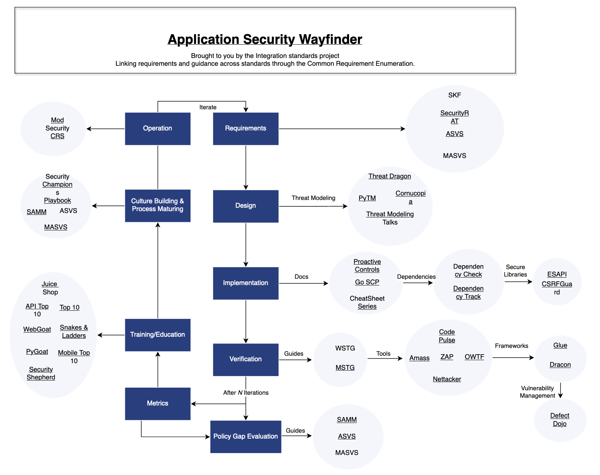

Open source + Security = ❤️ 
===

###### by Adrien Pessu ([@adrienpessu][GitHub])   

[GitHub]: https://github.com/adrienpessu
---

# Introduction

---

# Introduction

---

# Introduction

---

# Agenda

* :factory: OWASP
* :memo: Open source security foundation 
* :gear: MITRE
* :tv: How to open source

---

# :factory: OWASP

The *Open Web Application Security Project®* (OWASP) is a __nonprofit foundation__ that works to improve the security of software. 
- open-source software projects, 
- hundreds of local chapters worldwide, 
- tens of thousands of members, 
- and leading educational and training conferences

---

# :factory: OWASP

https://owasp.org/Top10/fr/

---

# :factory: OWASP

---

# :factory: OWASP ZAP (Zed Attack Proxy)

- Proxy
- App Scanner

---

# :factory: OWASP Dependency-check

 

`dependency-check --project "myproject" --scan [project_path] --out [output_path]`

---   
# :factory: OWASP AMASS

Network mapping of attack surfaces and external asset discovery. Using Information Gathering Techniques :
- API : Pastebin, Twitter, GitHub, ....
- Certificates: Digitorus, FacebookCT, GoogleCT, ...
- DNS: Brute forcing, Reverse DNS sweeping, NSEC zone walking, ..

Routing, Scraping, Web Archives, WHOIS

`amass enum -d example.com`

---

# :memo: Open source security foundation (OpenSSF)

Cross-industry forum for a collaborative effort to improve open source software security.

*GitHub, Google, IBM, JPMorgan Chase, Microsoft, NCC Group, OWASP Foundation, Red Hat, HackerOne, Intel, Okta, Purdue, Uber, WhiteSource, and VMware.*

--- 

# :memo: Open source security foundation (OpenSSF)

- Projects (like Sigstore, ...)
- Funding open source projects
- Free trainings
- Guides

--- 

# :gear: MITRE

- American not-for-profit organization
- *"provide evidence-based, objective and nonpartisan insights for government policymaking"*

---

# :gear: MITRE

- CVE : Common Vulnerabilities and Exposures
  

- ATT&CK : knowledge base of adversary tactics and techniques based on real-world observations

---

# :tv: How to open source but safely
<!-- _class: invert -->

## CodeQL && Secret scanning

---

# :tv: How to open source but safely
<!-- _class: invert -->

---

# :tv: How to open source but safely
<!-- _class: invert -->

---

# Conclusion

All over the world

We should contribute : 
- Code
- Doc
- Talks
- Blog posts
- ...

