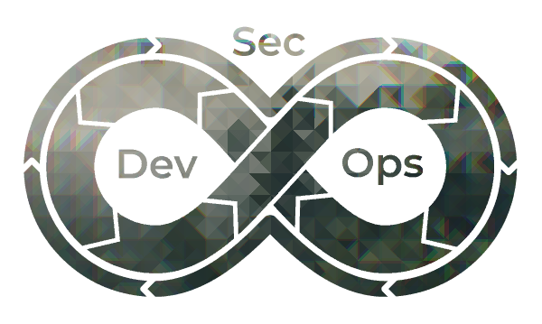
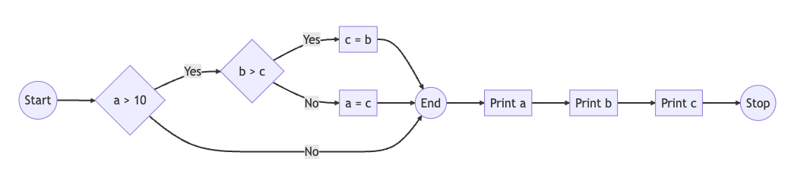
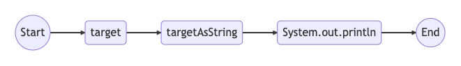

<style>
img[alt~="center"] {
  display: block;
  margin: 0 auto;
}
</style>

Introduction aux outils de tests de sécurité d'application statique (SAST)
===


###### by Adrien Pessu   


---

# Introduction



---

# Introduction


---

# Search in code

```
grep setDangerousHTML index.ts
```

---

# Remediation

```
sed -i 's/setDangerousHTML/void/g' index.ts
```

---

# Merci de votre attention


--- 

# Definition

OWASP

Source code analysis tools, also known as Static Application Security Testing (SAST) Tools, can help analyze source code or compiled versions of code to help find security flaws.

---

# :factory: Workflow


📝 Code => 🏗️ Models => 💬 Patterns => 📑 Results!

---

# 📝 Code

**Source Code Analysis** 
vs  
**Binary / Bytecode Analysis**

--- 

## 🏗️ Abstract Syntax Tree (AST) [Models]

```java
public class HelloWorld {
    public static void main(String[] args) {
        System.out.println("Hello, World!");
    }
}
```


---

# [Models] 🏗️ Control-flow graph 

```java
if  (a > 10) {
  if (b > c) {
     c = b;
  } else {
    a = c;
  }
}
System.out.println(a);
System.out.println(b);
System.out.println(c);
```
---

# [Models] 🏗️ Control-flow graph 



---


# [Models] 🏗️ Data-flow graph 

```java
int target = input();

String targetAsString = "Input: " + target

System.out.println(targetAsString)
```



---   


# ⚡ Taint Analysis

- Sources (user controlled inputs)
- Sinks (dangerous methods / assignments)
- Sanitizers (secures the user data)
- Validator
- Passthroughs (functions that track tainte- data)

<!-- Filter resuts -->

---

# ⚡ Pattern 1/2


Using something insecure

- Configurations / Setting
- "Is debugging set to True?"

---

# ⚡ Pattern 2/2


🏖️ Data flows into somewhere insecure

User Input => [some other stuff] => `sql.execute(input)`

---

# ⚡ Results


- ⚠️ Security Issues
  - SQL Injection, Cross Site Scripting, ...
- ✨ Best Practices
  - Using Key Vaults, ...
- 🔎 Code Quality and Code Smells
  - Long Functions, Duplicated code, ...
- 👍 Positive Results
    - Using appropriate hashing algorithm  
    - automatic encoding, ...

---

#  :wrench: Configuration

- 📏 Configuration Rules (yaml, json, data tructure...)
  - Simpler to write
  - Complex flows can be very hard to declare
- ⚙️ Dynamic Queries (#️⃣ programming like language)
  - Harder to learn and write
  - Complex flows are easier

---

# Demo?

---

# :fireworks: Conclusion

- Easy to configure
- False positive (Context)
- 📝 An automated tool to analyse source code
  - Automate Code Review
- 🔍 Discover known security issues
- 🔁 Discover repetitive security issues
- Remediation
- Security analysis for Security Engineers / Researchers

---


# Slides

https://adrienpessu.github.io/slides/introduction_to_SAST/


https://openfeedback.io/VWEMZHoBj0mPrdZ9Isso

Thanks to *@geekmasher*